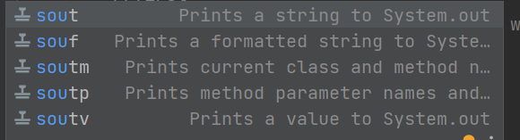
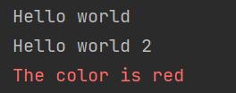

                                                                        به نام خدا
                                                                       IN THE NAME OF GOD
// We have two options for print information
//دوروش چاپ اطلاعات داریم 

//sout  write  System.out.println("");  println its means newline  but print It's simple
//souf  write  System.out.printf("");
out put : 
